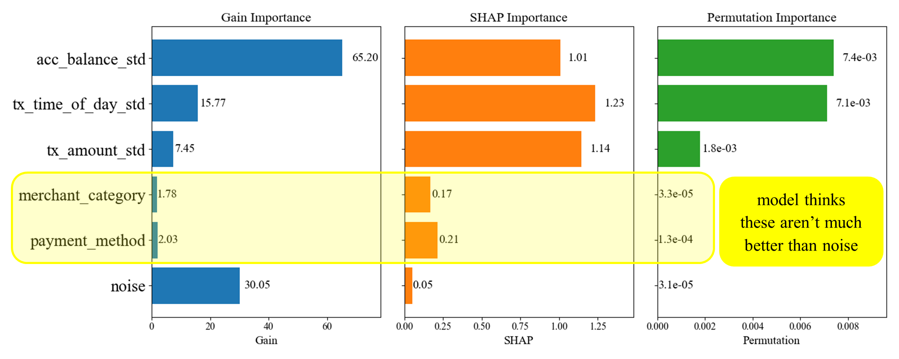

# Squeezing More Info Out of Fraud Data with Statisticis

This repository gives the analysis behind my November 21, 2025 LinkedIn post. 

## The LinkedIn Post

Your machine learning models are predicting fraud really well. But are they giving you the full picture? Are they giving you the critical clues you need to understand the current fraud threat?

Here’s an example where they don’t:

 
Why isn’t the model picking up these fraud signals? And how can statistical anomaly detection help? Check out my full write-up here: [dglassbrenner1/squeezing-more-info-out-of-fraud-data-w-statistics: the code behind a Nov 2025 LinkedIn post](https://github.com/dglassbrenner1/squeezing-more-info-out-of-fraud-data-w-statistics)

#DataScience #FraudDetection #MachineLearning #AnomalyDetection #Statistics

## How to Run the Notebook on Google Colab

   Just click on the Colab badge (icon) and run all. 

## Colab Badge

---

Thank you and enjoy!
